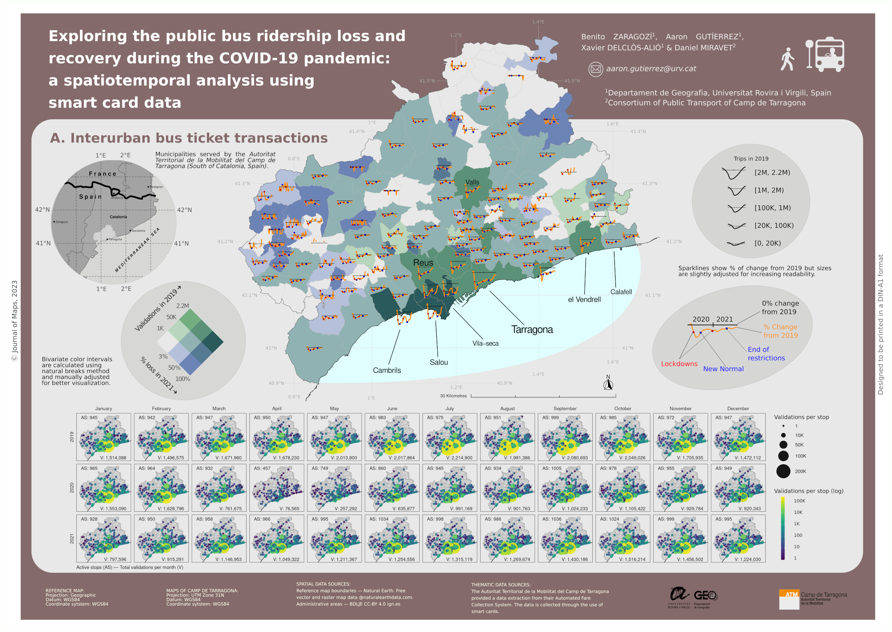
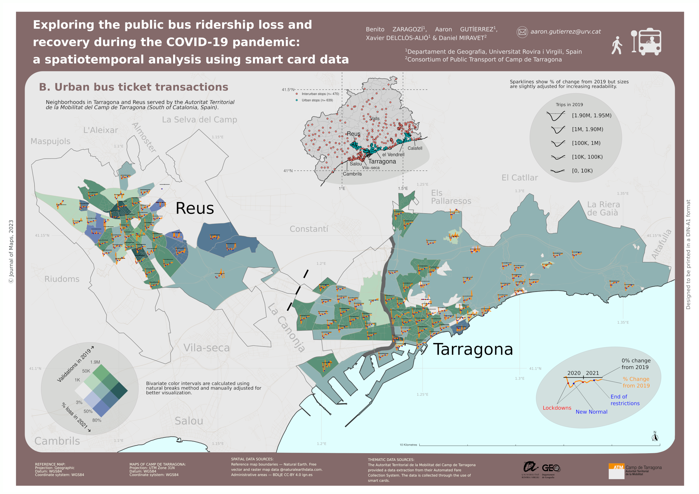

# Spatiotemporal Analysis of Public Bus Ridership Loss and Recovery During COVID-19 Using Smart Card Data

This repository contains the scripts and Dockerfile necessary to reproduce the cartographic and data analysis work conducted in our recent publication:

> Benito Zaragozí, Aaron Gutiérrez, Xavier Delclòs-Alió & Daniel Miravet (2023) Exploring the public bus ridership loss and recovery during the COVID-19 pandemic: a spatiotemporal analysis using smart card data, Journal of Maps, 19:1, DOI: [10.1080/17445647.2023.2231022](https://doi.org/10.1080/17445647.2023.2231022)




## Citation

If you find this repository helpful in your own work, please cite our paper as follows:

```bibtex
@article{zaragozi2023exploring,
  title={Exploring the public bus ridership loss and recovery during the COVID-19 pandemic: a spatiotemporal analysis using smart card data},
  author={Zaragozí, Benito and Gutiérrez, Aaron and Delclòs-Alió, Xavier and Miravet, Daniel},
  journal={Journal of Maps},
  volume={19},
  number={1},
  year={2023},
  publisher={Taylor & Francis},
  doi={10.1080/17445647.2023.2231022}
}

```

## Repository Contents

- /R/: This directory contains R scripts used for data processing and cartographic treatment. These scripts require the Tidyverse libraries.
- /dockerfile/: This directory contains the Dockerfile for setting up the working environment. This was done to facilitate the reproducibility of the analysis.


## Usage

Due to data privacy agreements, the Automated Fare Collection (AFC) microdata used in our study is not included in this repository. You would need to provide your own data in order to run these scripts on your local machine.

However, the analysis scripts and Dockerfile can still be used as a template for similar studies. Follow the steps below to use this repository:

1. Clone this repository to your local machine.
2. Replace placeholder data files with your own dataset, maintaining the same file structure.
3. Run the R scripts within the R environment to process your data and generate the maps.
4. Use Docker to recreate the analysis environment. Refer to the Dockerfile for the necessary dependencies.
5. Use Inkscape for manual composition layout based on the example files provided.

Please note that while the R scripts and Dockerfile are provided to support reproducibility, you will need to adjust these to match your own dataset and research questions.

## Contact

For more information, please refer to the published paper and feel free to contact the authors via the corresponding author affiliation.
